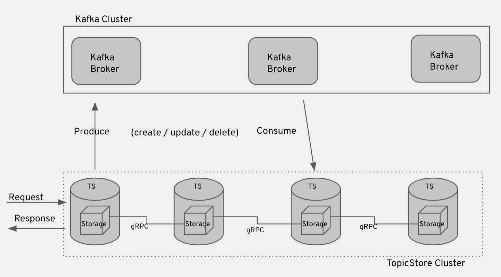

# Topic store (new Kafka Streams based implementation) - design document

Topic store represents a persistent data store where the operator can store its copy of the 
topic state that won't be modified by either K8S or Kafka.
Currently we have ZooKeeper based working implementation, but with ZooKeeper being removed 
as part of KIP-500, we decided to implement the store directly in/on Kafka, its Streams
extension to be exact.

TopicStore interface is a simple async CRUD API.

```
interface TopicStore {

    /**
     * Asynchronously get the topic with the given name
     * completing the returned future when done.
     * If no topic with the given name exists, the future will complete with
     * a null result.
     * @param name The name of the topic.
     * @return A future which completes with the given topic.
     */
    Future<Topic> read(TopicName name);

    /**
     * Asynchronously persist the given topic in the store
     * completing the returned future when done.
     * If a topic with the given name already exists, the future will complete with an
     * {@link EntityExistsException}.
     * @param topic The topic.
     * @return A future which completes when the given topic has been created.
     */
    Future<Void> create(Topic topic);

    /**
     * Asynchronously update the given topic in the store
     * completing the returned future when done.
     * If no topic with the given name exists, the future will complete with a
     * {@link NoSuchEntityExistsException}.
     * @param topic The topic.
     * @return A future which completes when the given topic has been updated.
     */
    Future<Void> update(Topic topic);

    /**
     * Asynchronously delete the given topic from the store
     * completing the returned future when done.
     * If no topic with the given name exists, the future will complete with a
     * {@link NoSuchEntityExistsException}.
     * @param topic The topic.
     * @return A future which completes when the given topic has been deleted.
     */
    Future<Void> delete(TopicName topic);
}
```

The TopicStore is used from TopicOperator, which is used from web/Vert.x invocations
and ZooKeeper watcher callbacks. The later - ZooKeeper watcher callbacks - also need
to be replaced once KIP-500 is fully/properly implemented.

At the moment there seems to be the need for only a single instance of TopicStore, which
is important detail with regard to the new Kafka Streams based implementation.

### Kafka Streams based implementation

In Kafka Streams you describe/configure your topics, processing, etc with so called [Topology](https://kafka.apache.org/25/javadoc/org/apache/kafka/streams/Topology.html).
That way you describe the flow of your messages. In-between this processing you can make use
of [Kafka Streams store](https://kafka.apache.org/20/documentation/streams/developer-guide/interactive-queries.html) 
concept. This is a local in-memory store, which is backed by auto-generated topic (by Kafka Streams)
so that data is properly persisted in case of any failures or shutdown.

The "problem" with the store, as you can read, is that we only get local in-memory representation/implementation
out-of-the-box, where data is actually distributed per key hashing, meaning that it's stored in exactly 
one of the existing running instances of the in-memory store - depending which Kafka Streams topology consumer instance consumed the message.

So what if our application, in our case TopicStore instance, is running in a cluster aka distributed?
Then you need to provide your own distributed mechanism for the data lookup. Although the distributed implementation 
is not available, there is a [Kafka Streams API](https://kafka.apache.org/25/javadoc/org/apache/kafka/streams/KafkaStreams.html) that provides you with the needed information to (easily) implement
this distributed mechanism - e.g. you can get key's owner [HostInfo](https://kafka.apache.org/25/javadoc/org/apache/kafka/streams/state/HostInfo.html)
or all available/running store's HostInfos.

In our case we went with [gRPC](https://grpc.io/) as the base for this distributed implementation. We needed to provide
both the client and the server side. gRPC has [streaming API](https://docs.oracle.com/javase/8/docs/api/java/util/stream/Stream.html) supported 
via its [StreamObserver](https://grpc.github.io/grpc-java/javadoc/io/grpc/stub/StreamObserver.html) mechanism - which is what we used
to implement [ReadOnlyKeyValueStore API](https://kafka.apache.org/25/javadoc/org/apache/kafka/streams/state/ReadOnlyKeyValueStore.html)
iterating methods. The data exchanged between gRPC client and server is [Protobuf](https://developers.google.com/protocol-buffers) based.  

The next problem we had to tackle is the async nature and no callback API in Kafka.
In order to provide proper result (success or failure) for those TopicStore async CRUD methods,
we implemented async gRPC based functions. Prior to pushing data into the above mentioned store
(via producing a Kafka message), we issue a distributed function call, which registers a CompletableFuture
on the right node (using same key hashing as next store update call) which is returned when the data is actually updated in the store.
Data lookup is done directly on the distributed store impl, no distributed function call needed.

If we don't need distribution / cluster, things get simplifed a lot - no gRPC needed, plain local in-memory store and async function.
By default this simple single instance is expected. In order to use the distributed implementation,
you need to set STRIMZI_DISTRIBUTED_STORE env variable to "true".

Other configuration options are listed here:
```
    /**
     * The store topic for the Kafka Streams based TopicStore
     */
    public static final Value<String> STORE_TOPIC = new Value<>(TC_STORE_TOPIC, STRING, "store-topic");
    /** The store name for the Kafka Streams based TopicStore */
    public static final Value<String> STORE_NAME = new Value<>(TC_STORE_NAME, STRING, "__strimzi_topic_store");
    /** The application id for the Kafka Streams based TopicStore */
    public static final Value<String> APPLICATION_ID = new Value<>(TC_APPLICATION_ID, STRING, "strimzi-topic-store");
    /** The (gRPC) application server for the Kafka Streams based TopicStore */
    public static final Value<String> APPLICATION_SERVER = new Value<>(TC_APPLICATION_SERVER, STRING, "localhost:9000");
    /** The stale timeout for the Kafka Streams based TopicStore */
    public static final Value<Long> STALE_RESULT_TIMEOUT_MS = new Value<>(TC_STALE_RESULT_TIMEOUT_MS, DURATION, "1000");
    /** Is distributed KeyValue store used for the Kafka Streams based TopicStore */
    public static final Value<Boolean> DISTRIBUTED_STORE = new Value<>(TC_DISTRIBUTED_STORE, BOOLEAN, "false");
```

A cluster of TopicStore (Storage) would look like this:



And a simple lookup:

